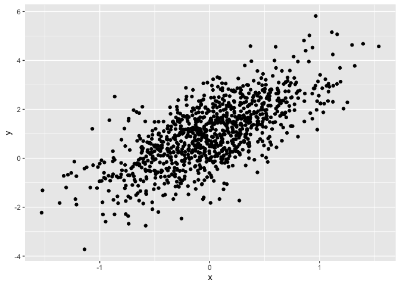
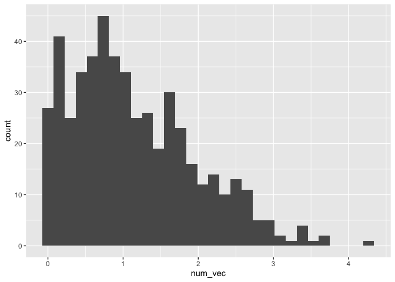
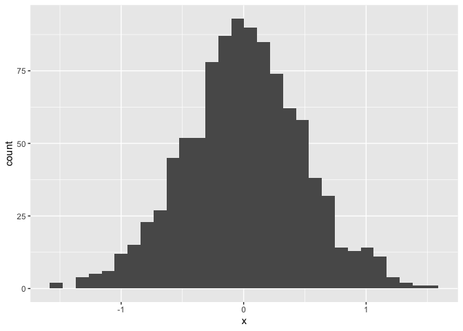

A really not so simple document
================
Sophie
2026-09-17

I’m an R Markdown document!

# Section 0

``` r
library (tidyverse)
```

# Section 1

Here’s a **code chunk** that samples from a *normal distribution*:

``` r
samp = rnorm(100)
length(samp)
```

    ## [1] 100

# Section 2

MISSING, accidentally deleted

# Section 3

``` r
plot_df = 
  tibble(
    x = rnorm(1000, sd = 0.5), 
    y = 1 + 2 * x + rnorm(1000),
  )

tail(plot_df)
```

    ## # A tibble: 6 × 2
    ##         x      y
    ##     <dbl>  <dbl>
    ## 1 -0.589  -0.169
    ## 2 -0.0533  0.990
    ## 3  0.934   1.62 
    ## 4 -0.110   1.52 
    ## 5 -0.150   1.23 
    ## 6 -0.650  -1.12

# Section 4

``` r
ggplot(plot_df, aes(x=x)) + geom_histogram()
```

    ## `stat_bin()` using `bins = 30`. Pick better value `binwidth`.

<!-- -->

``` r
ggplot(plot_df, aes(x=x, y=y)) + geom_point()
```

<!-- -->

# Section 5: Learning Assessment 2

Write a named code chunk that creates a dataframe comprised of: a
numeric variable containing a random sample of size 500 from a normal
variable with mean 1; a logical vector indicating whether each sampled
value is greater than zero; and a numeric vector containing the absolute
value of each element. Then, produce a histogram of the absolute value
variable just created. Add an inline summary giving the median value
rounded to two decimal places. What happens if you set eval = FALSE to
the code chunk? What about echo = FALSE?

This plot shows the distribution of the absolute value of
$X \sim N(1,1)$.

``` r
library(tidyverse)

set.seed(0)

la_df = tibble(
  num_var = rnorm(500, mean = 1),
  log_vec = num_var > 0,
  num_vec = abs(num_var)
)

ggplot(la_df, aes(x = num_vec)) + geom_histogram()
```

    ## `stat_bin()` using `bins = 30`. Pick better value `binwidth`.

<!-- --> The median of the
variable containing absolute values is 0.94.

# Section 6: Formatting

## Text formatting

*italic* or *italic* **bold** or **bold** `num_var`
superscript<sup>2</sup> and subscript<sub>2</sub>

## Headings

# 1st Level Header

## 2nd Level Header

### 3rd Level Header

## Lists

- Bulleted list item 1

- Item 2

  - Item 2a

  - Item 2b

1.  Numbered list item 1

2.  Item 2. The numbers are incremented automatically in the output.

## Tables

| First Header | Second Header |
|--------------|---------------|
| Content Cell | Content Cell  |
| Content Cell | Content Cell  |

# Section 7: Learning Assessment 3

After the previous code chunk, write a bullet list given the mean,
median, and standard deviation of the original random sample

- The median is: 0.94.

- The mean is : 1.

- The standard deviation is: 0.99.

what if I try to add a histogram

``` r
ggplot(plot_df, aes(x=x)) + geom_histogram()
```

    ## `stat_bin()` using `bins = 30`. Pick better value `binwidth`.

<!-- --> heres a new
line.
